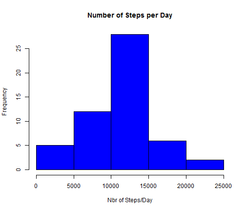
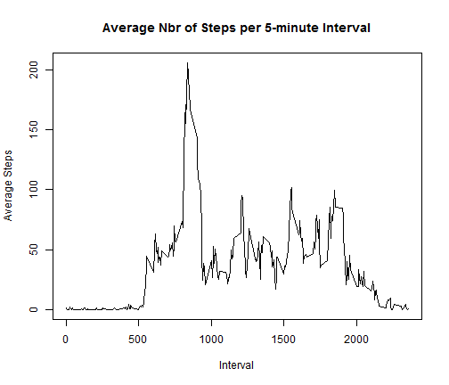
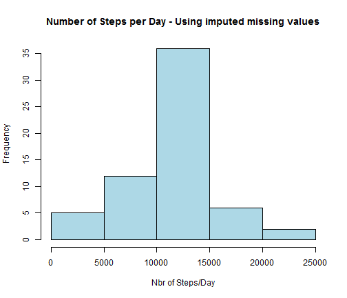

# Reproducible Research: Peer Assessment 1
## Introduction

It is now possible to collect a large amount of data about personal
movement using activity monitoring devices such as a
[Fitbit](http://www.fitbit.com), [Nike
Fuelband](http://www.nike.com/us/en_us/c/nikeplus-fuelband), or
[Jawbone Up](https://jawbone.com/up). These type of devices are part of
the "quantified self" movement -- a group of enthusiasts who take
measurements about themselves regularly to improve their health, to
find patterns in their behavior, or because they are tech geeks. But
these data remain under-utilized both because the raw data are hard to
obtain and there is a lack of statistical methods and software for
processing and interpreting the data.

This assignment makes use of data from a personal activity monitoring
device. This device collects data at 5 minute intervals through out the
day. The data consists of two months of data from an anonymous
individual collected during the months of October and November, 2012
and include the number of steps taken in 5 minute intervals each day.

## Data

The data for this assignment can be downloaded from:

* Dataset: [Activity monitoring data](https://d396qusza40orc.cloudfront.net/repdata%2Fdata%2Factivity.zip) [52K]

The variables included in this dataset are:
* **steps**: Number of steps taking in a 5-minute interval (missing
    values are coded as `NA`)
* **date**: The date on which the measurement was taken in YYYY-MM-DD
    format
* **interval**: Identifier for the 5-minute interval in which
    measurement was taken

The dataset is stored in a comma-separated-value (CSV) file and there
are a total of 17,568 observations in this dataset.


## Set the default options for r chunks
1. print code
2. enable caching
3. set plot size


```r
opts_chunk$set(echo=TRUE, cache=TRUE, fig.width=7, fig.height=6)
```

## Loading and preprocessing the data
1. Load packages required 
  + plyr for function ddply()
  + ggplot2 for function ggplot()
2. Set the appropriate path
3. Unzip and read the activity data file


```r
library(plyr)
library(ggplot2)

setwd("~/r/rr1/RepData_PeerAssessment1")
filepath <- "~/r/rr1/RepData_PeerAssessment1/activity.zip"
act <- read.csv(unz(filepath,"activity.csv"),header=TRUE)
#closeAllConnections()
```
## What is mean total number of steps taken per day?
#### Steps for execution
1. Consider only cases that have no missing(NA) values
2. Summarize step data by each day using ddply() function
3. Plot the histogram for total number of steps per day
4. Calculate the mean and median for the total number of steps


```r
newact <- act[complete.cases(act),]
sumact <- ddply(newact,.(date),summarise,steps=sum(steps))

hist(sumact$steps,col="blue",xlab="Nbr of Steps/Day",main="Number of Steps per Day")
```

 

```r
meansteps <- mean(sumact$steps)
medsteps <- median(sumact$steps)
paste("Mean total nbr of steps per day is",meansteps)
```

```
## [1] "Mean total nbr of steps per day is 10766.1886792453"
```

```r
paste("Median total nbr of steps per day is",medsteps)
```

```
## [1] "Median total nbr of steps per day is 10765"
```

## What is the average daily activity pattern?
#### Steps for execution
1. Consider the dataset from prior with only cases with no missing(NA) values
2. Obtain the average(mean) step data by each 5-minute interval using ddply()
3. Plot the average number of steps per each 5-minute interval
4. Determine the interval with the higest number of steps


```r
avgact <- ddply(newact,.(interval),summarise,steps=mean(steps))

plot(avgact$interval,avgact$steps,type='l',ylab="Average Steps",xlab="Interval",main="Average Nbr of Steps per 5-minute Interval")
```

 

```r
highestint<-avgact[avgact$steps==max(avgact$steps),]$interval
paste("The interval with the highest nbr of steps is", highestint)
```

```
## [1] "The interval with the highest nbr of steps is 835"
```

## Imputing missing values
#### Steps for execution
1. Count all cases with NA values
2. Extract the NA-only rows and apply the average(mean) steps per interval to each NA row
3. Combine the NA-only dataset with the complete cases dataset from a prior r chunk
4. Do the following for the combined dataset 
  + Plot the histogram for total number of steps per day
  + Calculate the mean and median for the total number of steps


```r
countna <- sum(!complete.cases(act))
paste("Nbr of rows with NA data is",countna)
```

```
## [1] "Nbr of rows with NA data is 2304"
```

```r
nact <- subset(act,is.na(steps))
nact <- merge(nact,avgact,by="interval",all.x=FALSE)
nact <- nact[names(nact) %in% c("steps.y","date","interval")]
nact <- nact[,3:1]
colnames(nact)[1]<-c("steps")

allact <- rbind(newact,nact)
sumact <- ddply(allact,.(date),summarise,steps=sum(steps))
hist(sumact$steps,col="lightblue",xlab="Nbr of Steps/Day",main="Number of Steps per Day - Using imputed missing values")
```

 

```r
meansteps <-mean(sumact$steps)
medsteps  <-median(sumact$steps)
paste("With imputed missing values, mean total nbr of steps per day is",meansteps)
```

```
## [1] "With imputed missing values, mean total nbr of steps per day is 10766.1886792453"
```

```r
paste("With imputed missing values, median total nbr of steps per day is",medsteps)
```

```
## [1] "With imputed missing values, median total nbr of steps per day is 10766.1886792453"
```

## Are there differences in activity patterns between weekdays and weekends?
#### Steps for execution
1. Identify weekday and weekend data 
2. Summarise the average number of steps per 5-min interval by weekday and weekend
3. Print a panel plot for side by side comparion of step data by weekday and weekend

```r
allact$day <- weekdays(as.Date(allact$date))
allact$daytype[allact$day %in% c("Saturday","Sunday")]<-c("weekend")
allact$daytype[!allact$day %in% c("Saturday","Sunday")]<-c("weekday")

sumallact <- ddply(allact,.(daytype,interval),summarise,steps=mean(steps))

pplot <- ggplot(sumallact,aes(x=interval,y=steps),main="Weekend versus Weekday Activity") + geom_line() +facet_grid(daytype~.)
print(pplot)
```

 

